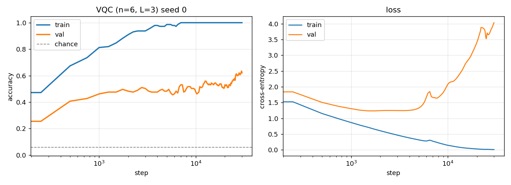
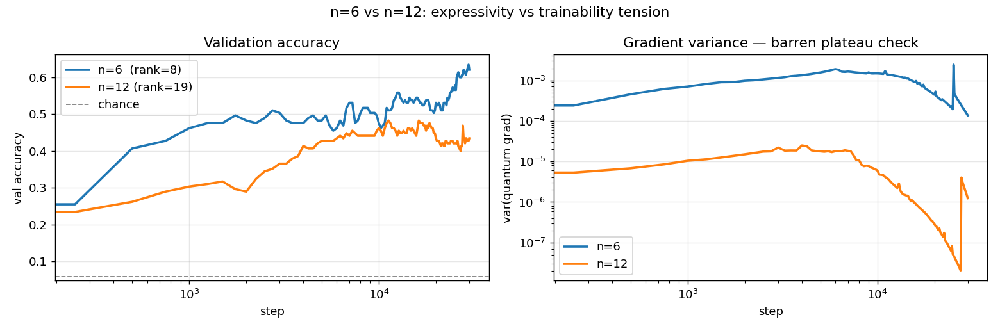
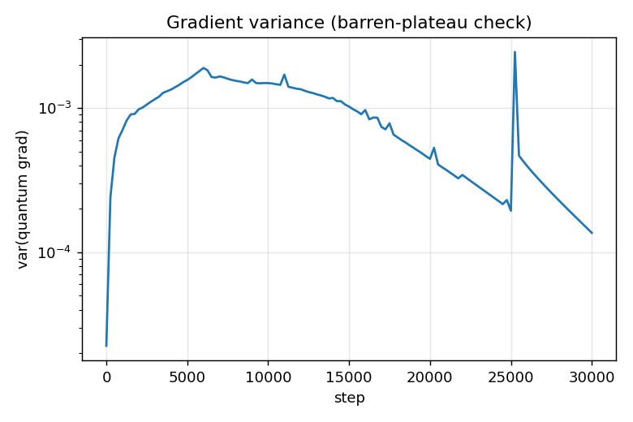
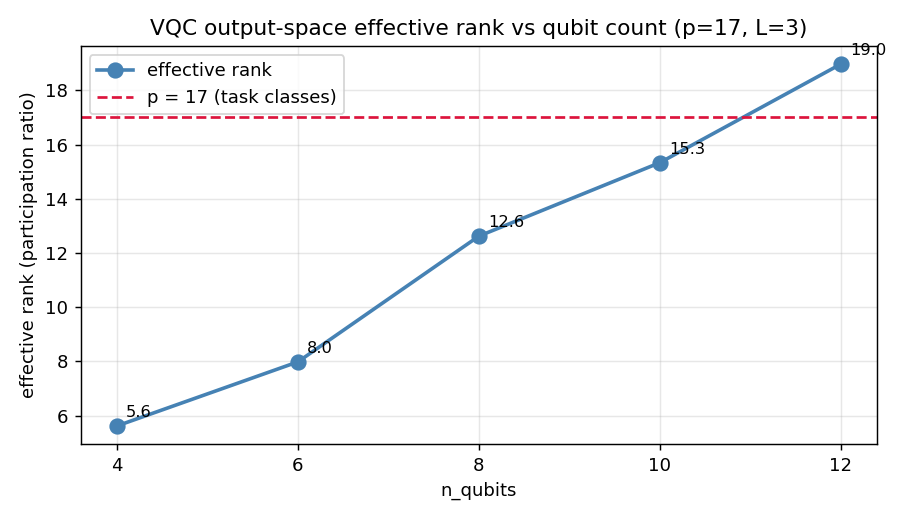

# VQC Grokking: Do Variational Quantum Circuits Grok Modular Arithmetic?

**VQCs cannot grok modular arithmetic under single-qubit PauliZ readout: fixing the
expressivity bottleneck (n=6 → n=12) triggers a barren plateau, while avoiding the
barren plateau (n=6) leaves the circuit expressivity-limited. The two necessary
conditions for grokking — sufficient rank and healthy gradients — are mutually
exclusive at this readout.**

**Demonstrates:** the circuit representation bottleneck — not gradient vanishing — as the
fundamental obstacle to quantum grokking at current qubit counts, and the expressivity–
trainability tension that prevents naive scaling from fixing it.

---

## Background

Classical grokking (Power et al. 2022, Nanda et al. 2023): a 1-layer transformer trained
on `(a + b) mod p` first memorises the training set (train → 100%, val ≈ chance), then
after prolonged training under weight decay suddenly generalises. Analysis of the weights
reveals a **Fourier circuit** — the model represents integers as complex exponentials
`e^(2πikn/p)` and uses trig identities to compute modular sums.

This project asks: does a VQC exhibit the same phenomenon?

---

## Task

`(a + b) mod p`, `p = 17`. All 289 ordered pairs `(a, b) ∈ {0,...,16}²`.
50/50 train/val split (fixed seed). Loss: cross-entropy over 17 classes.

---

## Architecture

```
Input: θ_a = 2π·a/p,  θ_b = 2π·b/p

Encoding (data re-uploading):
  RY(θ_a) on qubits 0, 2, 4   |   RY(θ_b) on qubits 1, 3, 5

Trainable layers (L=3):
  Rot(φ, θ, ω) on each qubit  +  CNOT ring entangler

Readout:
  E[Z_i] for each qubit  →  Linear(n_qubits, 17)  →  softmax

n=6:  quantum params=54,  head params=119
n=12: quantum params=108, head params=221
```

Training: AdamW, lr=1e-2, weight_decay=1.0 on quantum params. 30,000 steps.

---

## Results

### MLP sanity check — confirmed grok

The classical MLP (embedding-sum + 1 hidden layer, same weight decay) groks the task:

| step | train | val |
|------|-------|-----|
| 250  | 1.000 | 0.04 (memorised) |
| 9 000 | 1.000 | 0.78 |
| 29 250 | 1.000 | **0.95 (grokked)** |

Classic signature: memorise immediately, generalise slowly under weight decay pressure.

### VQC n=6 — expressivity-limited



| metric | value |
|--------|-------|
| train_acc (final) | 1.000 |
| max val_acc | **0.634** @ step 29,750 |
| chance level | 0.059 (1/17) |
| grok threshold | 0.95 — **not reached** |

Val accuracy climbs well above chance but plateaus. The val **loss** diverges to 4.0
while train loss → 0 — the opposite of the late val-loss drop that characterises grokking.

### VQC n=12 — barren plateau emerges



Running n=12 (sufficient expressivity, rank=19) does not rescue grokking. Gradient
variance collapses 100× relative to n=6 and val accuracy is actually *worse*:

| step | n=6 val | n=12 val | n=6 gvar | n=12 gvar |
|------|---------|----------|----------|-----------|
| 0    | 0.076   | 0.076    | 2.2e-05  | 7.9e-06   |
| 5 000 | 0.483  | 0.428    | 1.6e-03  | 1.8e-05   |
| 10 000 | 0.476 | 0.462   | 1.5e-03  | 6.0e-06   |
| 20 000 | 0.531 | 0.434   | 4.4e-04  | 2.9e-07   |
| 30 000 | **0.634** | 0.434 | 1.4e-04 | **1.2e-06** |

At 30k steps the n=12 gradient variance has fallen to 1.2×10⁻⁶ (minimum 2×10⁻⁸ mid-run)
— well into barren-plateau territory — while n=6 stays 2 orders of magnitude higher.
n=12 max val (0.483) trails n=6 max val (0.634) despite having sufficient expressivity.

**The two failure modes cross between n=6 and n=12.** There is no configuration under
single-qubit PauliZ readout where both are simultaneously satisfied.

---

## Failure-Mode Analysis

### n=6: representation bottleneck, not optimization failure



Gradient variance at n=6 stays in **1×10⁻⁴ – 2×10⁻³** throughout all 30k steps —
healthy, no collapse. The optimizer always has a usable signal. The failure is purely
architectural: the circuit cannot form 17 independent output directions.

### Expressivity crossover at n=12 qubits



Effective rank (participation ratio of singular values over 500 random parameter sets):

| n_qubits | effective rank | vs p=17 |
|----------|----------------|---------|
| 4        | 5.6            | 33% |
| **6**    | **8.0**        | **47%** |
| 8        | 12.6           | 74% |
| 10       | 15.3           | 90% |
| **12**   | **19.0**       | **≥ p** ← crossover |

The crossover to sufficient expressivity is n=12, but the n=12 training result shows
that sufficient expressivity is a necessary, not sufficient, condition for grokking:
at n=12 the barren plateau suppresses the gradient signal before generalisation can occur.

---

## Comparison to the Classical Fourier Circuit

In the classical grokking result the model implements a Fourier basis:
`cos(2πka/p)` and `sin(2πka/p)` at a sparse set of frequencies `k`. This works
because the MLP's embedding-sum architecture has both sufficient representational
width (rank ≥ 17) and healthy gradients throughout training.

The VQC under PauliZ readout satisfies neither condition simultaneously:

| | MLP | VQC n=6 | VQC n=12 |
|---|---|---|---|
| effective rank ≥ p=17 | ✓ | ✗ (rank=8) | ✓ (rank=19) |
| gradient variance healthy | ✓ | ✓ | ✗ (→ 1.2e-6) |
| groks | ✓ | ✗ | ✗ |

The partially-learned n=6 representation (val≈63%) likely corresponds to the dominant
~8 Fourier modes of the modular-addition task; the remaining 9 modes are structurally
inaccessible. This is a qualitative difference from the classical case, not a speed gap.

**The architectural fix the analysis points toward:** richer readout operators (two-qubit
correlators `Z_i Z_j` give O(n²) output dimensions) would push the expressivity crossover
below n=6 without expanding the qubit count, potentially side-stepping the barren plateau.
That experiment is left as future work.

---

## Project Structure

```
vqc_grokking/
  config.py               # hyperparameters
  src/
    dataset.py            # modular arithmetic dataset + splits
    circuit.py            # PennyLane VQC (encoding + layers + measurement)
    model.py              # VQCModel: circuit + classical linear head
    train.py              # training loop, CSV logging, checkpointing
    mlp_baseline.py       # classical MLP sanity check
    analysis.py           # failure-mode analysis + Fourier (if grokked)
    plotting.py           # all figure generation
  scripts/
    train_vqc.sh          # default run (p=17, n=6, L=3, 3 seeds)
    run_analysis.sh       # analysis on best checkpoint
    sweep.sh              # n_qubits × L sweep
  tests/
    test_dataset.py       # 5 tests: size, split, leakage, labels, determinism
    test_circuit.py       # 3 tests: shape, range, gradient flow
    test_mlp.py           # 2 tests: memorise early, val climbs above chance
  figures/
    vqc_curves_seed0.png            # n=6 train/val curves
    vqc_curves_nq12_seed0.png       # n=12 train/val curves
    n6_vs_n12_comparison.png        # side-by-side val_acc + grad_var
    grad_variance_nq6_L3_seed0.png
    grad_variance_nq12_L3_seed0.png
    effective_rank_vs_nqubits.png
  results/                # CSV logs + checkpoints (gitignored)
```

---

## Requirements

```
pennylane==0.45.0
torch==2.11.0
numpy>=1.24
scipy>=1.10
matplotlib>=3.7
```

Run tests: `python -m pytest tests/ -q` (10 tests, ~60 s, fully offline)

Train VQC (n=6): `python -m src.train --seed 0 --steps 30000`

Train VQC (n=12): `python -m src.train --n_qubits 12 --seed 0 --steps 30000`

Rank sweep: `python -m src.analysis --n_qubits 6 --mode failure`
